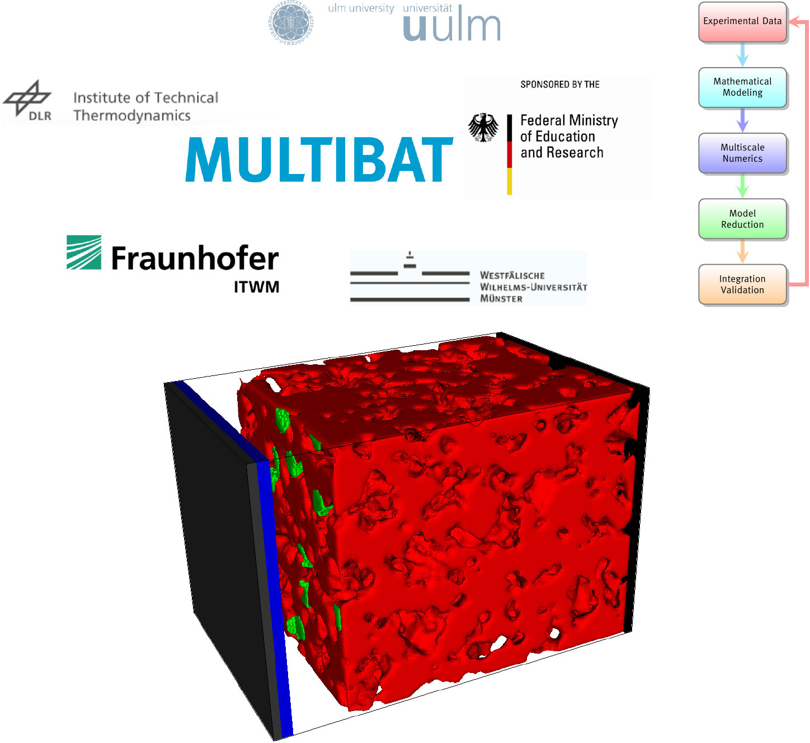
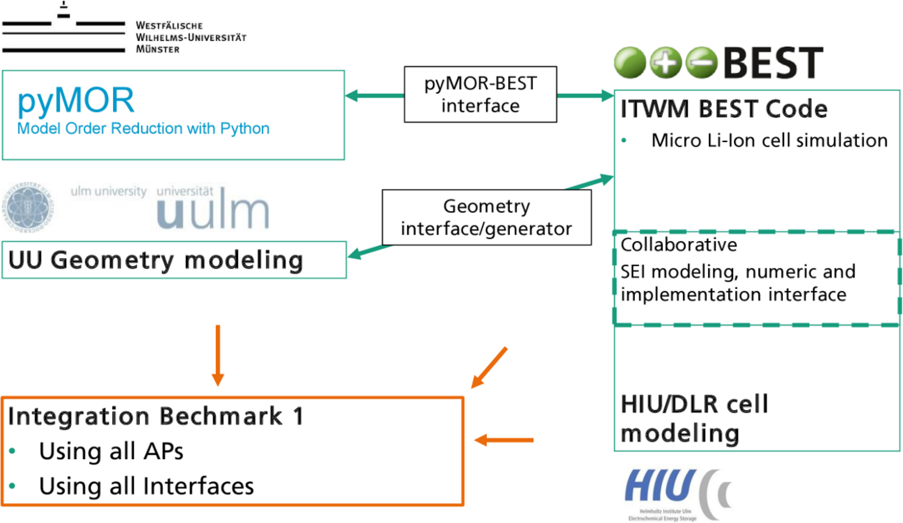
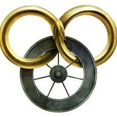
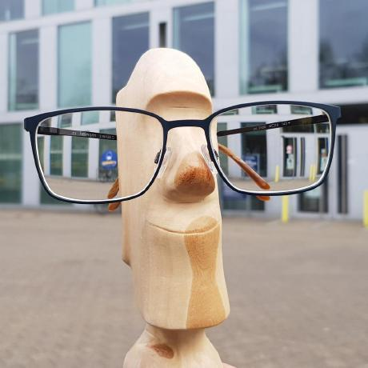

+++ {"slideshow": {"slide_type": "slide"}}

# pyMOR Intro

+++ {"slideshow": {"slide_type": "subslide"}}

## Why?

## What?

## How?

+++ {"slideshow": {"slide_type": "slide"}}

# Why?

+++ {"slideshow": {"slide_type": "subslide"}}

## Why FLOSS?

+++ {"slideshow": {"slide_type": "fragment"}}

1. Why use FLOSS?
1. Why publish FLOSS?
1. Why contribute to a FLOSS project?

+++ {"slideshow": {"slide_type": "subslide"}}

## Why Python?

+++ {"slideshow": {"slide_type": "subslide"}}

## Why pyMOR?

+++ {"slideshow": {"slide_type": "fragment"}}

1. Why was pyMOR created?

+++ {"slideshow": {"slide_type": "fragment"}}

<table width=70%>
    <tr>
        <td></td>
        <td></td>
        <td></td>
    </tr>
    <tr>
        <td>René Fritze</td>
        <td>Stephan Rave</td>
        <td>Felix Schindler</td>
    </tr>
</table>

+++ {"slideshow": {"slide_type": "subslide"}}

<center></center>

+++ {"slideshow": {"slide_type": "subslide"}}

<center></center>

+++ {"slideshow": {"slide_type": "subslide"}}

2. Why should I use pyMOR?

+++ {"slideshow": {"slide_type": "slide"}}

# What?

+++ {"slideshow": {"slide_type": "subslide"}}

## What is pyMOR?

- Python package for model order reduction
- started in October 2012
- 25k lines of Python code (17k lines of docs)
- 8k commits
- permissive license (BSD 2-clause)

+++ {"slideshow": {"slide_type": "fragment"}}

## Goals

1. one library for algorithm development and large-scale applications
2. unified approach on MOR

+++ {"slideshow": {"slide_type": "subslide"}}

## Main Developers

<table width=70%>
    <tr>
        <td></td>
        <td></td>
        <td></td>
        <td></td>
        <td></td>
        <td></td>
    </tr>
    <tr>
        <td>Linus Balicki</td>
        <td>René Fritze</td>
        <td>Hendrik Kleikamp</td>
        <td>Petar Mlinarić</td>
        <td>Stephan Rave</td>
        <td>Felix Schindler</td>
    </tr>
</table>

+++ {"slideshow": {"slide_type": "fragment"}}

## Code Contributors

<table width=90%>
    <tr>
        <td></td>
        <td></td>
        <td></td>
        <td></td>
        <td></td>
        <td></td>
        <td></td>
    </tr>
    <tr>
        <td>Meret Behrens</td>
        <td>@bergdola</td>
        <td>Patrick Buchfink</td>
        <td>Andreas Buhr</td>
        <td>@cabuze</td>
        <td>Monica Dessole</td>
        <td>Dennis Eickhorn</td>
    </tr>
    <tr>
        <td></td>
        <td></td>
        <td></td>
        <td></td>
        <td></td>
        <td></td>
        <td></td>
    </tr>
    <tr>
        <td>@hvhue</td>
        <td>Tim Keil</td>
        <td>Michael Laier</td>
        <td>Julia Maiwald</td>
        <td>G. D. McBain</td>
        <td>Luca Mechelli</td>
        <td>Mohamed Adel Naguib Ahmed</td>
    </tr>
    <tr>
        <td></td>
        <td></td>
        <td></td>
        <td></td>
        <td></td>
        <td></td>
        <td></td>
    </tr>
    <tr>
        <td>Jonas Nicodemus</td>
        <td>Peter Oehme</td>
        <td>Magnus Ostertag</td>
        <td>Art Pelling</td>
        <td>Michael Schaefer</td>
        <td>Sven Ullmann</td>
        <td>Josefine Zeller</td>
    </tr>
</table>

+++ {"slideshow": {"slide_type": "slide"}}

w# How?

+++ {"slideshow": {"slide_type": "subslide"}}

## LTI Models

+++ {"slideshow": {"slide_type": "-"}}

### Imports and Settings

```{code-cell} ipython3
---
slideshow:
  slide_type: '-'
---
import numpy as np
import scipy.linalg as spla
import matplotlib.pyplot as plt
from matplotlib.colors import LogNorm
from pymor.core.logger import set_log_levels
```

```{code-cell} ipython3
---
slideshow:
  slide_type: '-'
---
plt.rcParams['axes.grid'] = True
set_log_levels({
    'pymor.algorithms.gram_schmidt.gram_schmidt': 'WARNING',
    'pymor.reductors.basic.LTIPGReductor': 'WARNING',
})
```

+++ {"slideshow": {"slide_type": "subslide"}}

### Loading from Files

Rail model from [MOR Wiki](https://morwiki.mpi-magdeburg.mpg.de/morwiki/index.php/Steel_Profile).

```{code-cell} ipython3
---
slideshow:
  slide_type: '-'
---
from pymor.models.iosys import LTIModel

rail_fom = LTIModel.from_abcde_files('data/rail/rail_5177_c60')
```

```{code-cell} ipython3
---
slideshow:
  slide_type: fragment
---
rail_fom
```

```{code-cell} ipython3
---
slideshow:
  slide_type: fragment
---
rail_fom.A
```

```{code-cell} ipython3
---
slideshow:
  slide_type: fragment
---
rail_fom.A.matrix
```

```{code-cell} ipython3
---
slideshow:
  slide_type: fragment
---
print(rail_fom)
```

+++ {"slideshow": {"slide_type": "subslide"}}

### FOM Magnitude Plot

```{code-cell} ipython3
---
slideshow:
  slide_type: '-'
---
w = (1e-7, 1e3)
_ = rail_fom.transfer_function.mag_plot(w)
```

+++ {"slideshow": {"slide_type": "subslide"}}

### Hankel Singular Values

```{code-cell} ipython3
---
slideshow:
  slide_type: '-'
---
rail_hsv = rail_fom.hsv()
```

```{code-cell} ipython3
---
slideshow:
  slide_type: subslide
---
fig, ax = plt.subplots()
_ = ax.semilogy(rail_hsv, '.')
_ = ax.set_title('Hankel singular values')
```

+++ {"slideshow": {"slide_type": "slide"}}

## Balanced Truncation

```{code-cell} ipython3
---
slideshow:
  slide_type: fragment
---
from pymor.reductors.bt import BTReductor

rail_bt = BTReductor(rail_fom)
```

```{code-cell} ipython3
---
slideshow:
  slide_type: fragment
---
rail_rom_bt = rail_bt.reduce(20)
```

```{code-cell} ipython3
---
slideshow:
  slide_type: fragment
---
rail_rom_bt
```

```{code-cell} ipython3
---
slideshow:
  slide_type: subslide
---
rail_rom_bt.A.matrix
```

+++ {"slideshow": {"slide_type": "subslide"}}

### BT Poles

```{code-cell} ipython3
---
slideshow:
  slide_type: '-'
---
fig, ax = plt.subplots()
poles = rail_rom_bt.poles()
_ = ax.plot(poles.real, poles.imag, '.')
_ = ax.set_title('BT poles')
```

```{code-cell} ipython3
---
slideshow:
  slide_type: fragment
---
poles.real.max()
```

+++ {"slideshow": {"slide_type": "subslide"}}

### FOM and BT Magnitude Plots

```{code-cell} ipython3
---
slideshow:
  slide_type: '-'
---
w = (1e-6, 1e3)
_ = rail_fom.transfer_function.mag_plot(w)
_ = rail_rom_bt.transfer_function.mag_plot(w)
```

+++ {"slideshow": {"slide_type": "subslide"}}

### BT Error System

```{code-cell} ipython3
---
slideshow:
  slide_type: '-'
---
rail_err_bt = rail_fom - rail_rom_bt
```

```{code-cell} ipython3
---
slideshow:
  slide_type: fragment
---
_ = rail_err_bt.transfer_function.mag_plot(w)
```

+++ {"slideshow": {"slide_type": "subslide"}}

### $\mathcal{H}_2$ Relative Error

```{code-cell} ipython3
---
slideshow:
  slide_type: '-'
---
rail_err_bt.h2_norm() / rail_fom.h2_norm()
```

+++ {"slideshow": {"slide_type": "subslide"}}

### $\mathcal{H}_\infty$ Error Bounds

```{code-cell} ipython3
---
slideshow:
  slide_type: '-'
---
_ = plt.semilogy(rail_bt.error_bounds(), '.-')
```

+++ {"slideshow": {"slide_type": "slide"}}

## IRKA

```{code-cell} ipython3
---
slideshow:
  slide_type: fragment
---
from pymor.reductors.h2 import IRKAReductor

rail_irka = IRKAReductor(rail_fom)
```

```{code-cell} ipython3
---
slideshow:
  slide_type: fragment
---
rail_rom_irka = rail_irka.reduce(20, conv_crit='h2', num_prev=10)
```

```{code-cell} ipython3
---
slideshow:
  slide_type: subslide
---
rail_rom_irka
```

+++ {"slideshow": {"slide_type": "subslide"}}

### IRKA Convergence

```{code-cell} ipython3
_ = plt.semilogy(rail_irka.conv_crit, '.-')
```

+++ {"slideshow": {"slide_type": "subslide"}}

### IRKA Poles

```{code-cell} ipython3
---
slideshow:
  slide_type: '-'
---
fig, ax = plt.subplots()
poles = rail_rom_irka.poles()
_ = ax.plot(poles.real, poles.imag, '.')
_ = ax.set_title('IRKA poles')
```

```{code-cell} ipython3
---
slideshow:
  slide_type: fragment
---
poles.real.max()
```

+++ {"slideshow": {"slide_type": "subslide"}}

### FOM and IRKA Magnitude Plots

```{code-cell} ipython3
---
slideshow:
  slide_type: '-'
---
w = (1e-6, 1e3)
_ = rail_fom.transfer_function.mag_plot(w)
_ = rail_rom_irka.transfer_function.mag_plot(w)
```

+++ {"slideshow": {"slide_type": "subslide"}}

### IRKA Error System

```{code-cell} ipython3
---
slideshow:
  slide_type: '-'
---
rail_err_irka = rail_fom - rail_rom_irka
```

```{code-cell} ipython3
---
slideshow:
  slide_type: fragment
---
fig, ax = plt.subplots()
_ = rail_err_bt.transfer_function.mag_plot(w, ax=ax, label='BT')
_ = rail_err_irka.transfer_function.mag_plot(w, ax=ax, label='IRKA')
_ = ax.legend()
```

+++ {"slideshow": {"slide_type": "subslide"}}

### $\mathcal{H}_2$ Relative Error

```{code-cell} ipython3
---
slideshow:
  slide_type: '-'
---
rail_err_irka.h2_norm() / rail_fom.h2_norm()
```

+++ {"slideshow": {"slide_type": "subslide"}}

## Transfer Function

+++ {"slideshow": {"slide_type": "fragment"}}

Heat equation over a semi-infinite rod from \[Beattie/Gugercin '12\].

$$
\begin{align*}
  H(s) & = e^{-\sqrt{s}} \\
  H'(s) & = -\frac{e^{-\sqrt{s}}}{2 \sqrt{s}}
\end{align*}
$$

```{code-cell} ipython3
---
slideshow:
  slide_type: fragment
---
from pymor.models.transfer_function import TransferFunction

tf = TransferFunction(
    1,
    1,
    lambda s: np.array([[np.exp(-np.sqrt(s))]]),
    dtf=lambda s: np.array([[-np.exp(-np.sqrt(s)) / (2 * np.sqrt(s))]]),
)
```

```{code-cell} ipython3
---
slideshow:
  slide_type: fragment
---
tf
```

+++ {"slideshow": {"slide_type": "subslide"}}

### Bode Plot

```{code-cell} ipython3
---
slideshow:
  slide_type: '-'
---
w_tf = (1e-7, 1e4)
fig, ax = plt.subplots(2, 1, figsize=(6, 6), sharex=True, squeeze=False, constrained_layout=True)
_ = tf.bode_plot(w_tf, ax=ax)
```

+++ {"slideshow": {"slide_type": "slide"}}

## TF-IRKA

```{code-cell} ipython3
---
slideshow:
  slide_type: fragment
---
from pymor.reductors.h2 import TFIRKAReductor

tf_irka = TFIRKAReductor(tf)
```

```{code-cell} ipython3
---
slideshow:
  slide_type: fragment
---
tf_rom = tf_irka.reduce(20)
```

```{code-cell} ipython3
---
slideshow:
  slide_type: subslide
---
tf_rom
```

+++ {"slideshow": {"slide_type": "subslide"}}

### TF-IRKA Poles

```{code-cell} ipython3
---
slideshow:
  slide_type: '-'
---
fig, ax = plt.subplots()
poles = tf_rom.poles()
_ = ax.plot(poles.real, poles.imag, '.')
_ = ax.set_title('IRKA poles')
```

```{code-cell} ipython3
---
slideshow:
  slide_type: fragment
---
poles.real.max()
```

+++ {"slideshow": {"slide_type": "subslide"}}

### Bode Plots

```{code-cell} ipython3
---
slideshow:
  slide_type: '-'
---
fig, ax = plt.subplots(2, 1, figsize=(6, 6), sharex=True, squeeze=False, constrained_layout=True)
_ = tf.bode_plot(w_tf, ax=ax)
_ = tf_rom.transfer_function.bode_plot(w_tf, ax=ax)
```

+++ {"slideshow": {"slide_type": "subslide"}}

### Error System

```{code-cell} ipython3
---
slideshow:
  slide_type: '-'
---
tf_err = tf - tf_rom
```

```{code-cell} ipython3
---
slideshow:
  slide_type: fragment
---
_ = tf_err.mag_plot(w_tf)
```

+++ {"slideshow": {"slide_type": "slide"}}

## AAA

```{code-cell} ipython3
---
slideshow:
  slide_type: fragment
---
from pymor.reductors.aaa import PAAAReductor

sampling_values = 1j * np.logspace(-4, 2, 100)
sampling_values = np.concatenate((sampling_values, -sampling_values))
sampling_values = [sampling_values]
aaa = PAAAReductor(sampling_values, tf)
```

```{code-cell} ipython3
---
slideshow:
  slide_type: fragment
---
aaa_rom = aaa.reduce(tol=1e-4)
```

```{code-cell} ipython3
---
slideshow:
  slide_type: subslide
---
aaa_rom
```

+++ {"slideshow": {"slide_type": "subslide"}}

### Bode Plots

```{code-cell} ipython3
---
slideshow:
  slide_type: '-'
---
fig, ax = plt.subplots(2, 1, squeeze=False, constrained_layout=True)
_ = tf.bode_plot(w_tf, ax=ax)
_ = tf_rom.transfer_function.bode_plot(w_tf, ax=ax)
_ = aaa_rom.bode_plot(w_tf, ax=ax)
```

+++ {"slideshow": {"slide_type": "subslide"}}

### Error System

```{code-cell} ipython3
---
slideshow:
  slide_type: '-'
---
aaa_err = tf - aaa_rom
```

```{code-cell} ipython3
---
slideshow:
  slide_type: fragment
---
fig, ax = plt.subplots()
_ = tf_err.mag_plot(w_tf, ax=ax, label='TF-IRKA')
_ = aaa_err.mag_plot(w_tf, ax=ax, label='AAA')
_ = ax.legend()
```

+++ {"slideshow": {"slide_type": "slide"}}

## Parametric LTI Models

+++ {"slideshow": {"slide_type": "fragment"}}

Cookie model (thermal block) example from [MOR Wiki](https://morwiki.mpi-magdeburg.mpg.de/morwiki/index.php/Thermal_Block).

```{code-cell} ipython3
---
slideshow:
  slide_type: fragment
---
import scipy.io as spio

mat = spio.loadmat('data/cookie/ABCE.mat')
```

```{code-cell} ipython3
---
slideshow:
  slide_type: fragment
---
mat.keys()
```

```{code-cell} ipython3
---
slideshow:
  slide_type: fragment
---
A0 = mat['A0']
A1 = 0.2 * mat['A1'] + 0.4 * mat['A2'] + 0.6 * mat['A3'] + 0.8 * mat['A4']
B = mat['B']
C = mat['C']
E = mat['E']
```

```{code-cell} ipython3
---
slideshow:
  slide_type: fragment
---
A0
```

```{code-cell} ipython3
---
slideshow:
  slide_type: subslide
---
from pymor.operators.numpy import NumpyMatrixOperator

A0op = NumpyMatrixOperator(A0)
A1op = NumpyMatrixOperator(A1)
Bop = NumpyMatrixOperator(B)
Cop = NumpyMatrixOperator(C)
Eop = NumpyMatrixOperator(E)
```

```{code-cell} ipython3
---
slideshow:
  slide_type: fragment
---
A0op
```

```{code-cell} ipython3
---
slideshow:
  slide_type: subslide
---
from pymor.parameters.functionals import ProjectionParameterFunctional

Aop = A0op + ProjectionParameterFunctional('p') * A1op
```

```{code-cell} ipython3
---
slideshow:
  slide_type: fragment
---
Aop
```

```{code-cell} ipython3
---
slideshow:
  slide_type: subslide
---
cookie_fom = LTIModel(Aop, Bop, Cop, E=Eop)
```

```{code-cell} ipython3
---
slideshow:
  slide_type: fragment
---
cookie_fom
```

```{code-cell} ipython3
---
slideshow:
  slide_type: fragment
---
cookie_fom.parameters
```

+++ {"slideshow": {"slide_type": "subslide"}}

## Magnitude Plot

```{code-cell} ipython3
---
slideshow:
  slide_type: '-'
---
num_w = 10
num_p = 10
ws = np.logspace(-4, 4, num_w)
ps = np.logspace(-6, 2, num_p)
Hwp = np.empty((num_p, num_w))
for i in range(num_p):
    Hwp[i] = spla.norm(cookie_fom.transfer_function.freq_resp(ws, mu=ps[i]), axis=(1, 2))
```

```{code-cell} ipython3
---
slideshow:
  slide_type: fragment
---
fig, ax = plt.subplots()
out = ax.pcolormesh(ws, ps, Hwp, shading='gouraud', norm=LogNorm())
ax.set(
    xscale='log',
    yscale='log',
    xlabel=r'Frequency $\omega$ (rad/s)',
    ylabel='Parameter $p$',
    title=r'$\Vert H(i \omega, p) \Vert$',
)
ax.grid(False)
_ = fig.colorbar(out)
```

+++ {"slideshow": {"slide_type": "subslide"}}

### Interpolation

```{code-cell} ipython3
from pymor.algorithms.gram_schmidt import gram_schmidt
from pymor.reductors.interpolation import LTIBHIReductor

s_samples = np.logspace(-1, 1, 5)
s_samples = np.concatenate((1j * s_samples, -1j * s_samples))
p_samples = np.logspace(-3, -1, 5)
V = cookie_fom.A.source.empty()
W = cookie_fom.A.source.empty()
for p in p_samples:
    interp = LTIBHIReductor(cookie_fom, mu=p)
    interp.reduce(s_samples, np.ones((len(s_samples), 1)), np.ones((len(s_samples), 4)))
    V.append(interp.V)
    W.append(interp.W)

_ = gram_schmidt(V, copy=False)
_ = gram_schmidt(W, copy=False)
```

```{code-cell} ipython3
---
slideshow:
  slide_type: fragment
---
V
```

```{code-cell} ipython3
---
slideshow:
  slide_type: subslide
---
from pymor.reductors.basic import LTIPGReductor

pg = LTIPGReductor(cookie_fom, W, V)
cookie_rom = pg.reduce()
```

```{code-cell} ipython3
---
slideshow:
  slide_type: fragment
---
cookie_rom
```

+++ {"slideshow": {"slide_type": "subslide"}}

### Error System

```{code-cell} ipython3
---
slideshow:
  slide_type: '-'
---
cookie_err = cookie_fom - cookie_rom
```

```{code-cell} ipython3
---
slideshow:
  slide_type: fragment
---
Hwp_err = np.empty((num_p, num_w))
for i in range(num_p):
    Hwp_err[i] = spla.norm(cookie_err.transfer_function.freq_resp(ws, mu=ps[i]), axis=(1, 2))
```

```{code-cell} ipython3
---
slideshow:
  slide_type: fragment
---
fig, ax = plt.subplots()
out = ax.pcolormesh(ws, ps, Hwp_err, shading='gouraud', norm=LogNorm())
ax.set(
    xscale='log',
    yscale='log',
    xlabel=r'Frequency $\omega$ (rad/s)',
    ylabel='Parameter $p$',
    title=r'$\Vert H(i \omega, p) - H_r(i \omega, p) \Vert$',
)
ax.grid(False)
_ = fig.colorbar(out)
```

+++ {"slideshow": {"slide_type": "subslide"}}

### ROM Poles

```{code-cell} ipython3
for p in ps:
    poles = cookie_rom.poles(mu=p)
    print(poles.real.max())
```

+++ {"slideshow": {"slide_type": "subslide"}}

### Galerkin Projection

```{code-cell} ipython3
---
slideshow:
  slide_type: '-'
---
from pymor.algorithms.pod import pod

VW = V.copy()
VW.append(W)
VW, svals = pod(VW, modes=50)
```

```{code-cell} ipython3
VW
```

```{code-cell} ipython3
galerkin = LTIPGReductor(cookie_fom, VW, VW)
cookie_rom_g = galerkin.reduce()
```

+++ {"slideshow": {"slide_type": "subslide"}}

### Error System 2

```{code-cell} ipython3
---
slideshow:
  slide_type: '-'
---
cookie_err2 = cookie_fom - cookie_rom_g
```

```{code-cell} ipython3
---
slideshow:
  slide_type: fragment
---
Hwp_err2 = np.empty((num_p, num_w))
for i in range(num_p):
    Hwp_err2[i] = spla.norm(cookie_err2.transfer_function.freq_resp(ws, mu=ps[i]), axis=(1, 2))
```

```{code-cell} ipython3
---
slideshow:
  slide_type: fragment
---
fig, ax = plt.subplots()
out = ax.pcolormesh(ws, ps, Hwp_err2, shading='gouraud', norm=LogNorm())
ax.set(
    xscale='log',
    yscale='log',
    xlabel=r'Frequency $\omega$ (rad/s)',
    ylabel='Parameter $p$',
    title=r'$\Vert H(i \omega, p) - H_r(i \omega, p) \Vert$',
)
ax.grid(False)
_ = fig.colorbar(out)
```

+++ {"slideshow": {"slide_type": "subslide"}}

### ROM Poles 2

```{code-cell} ipython3
---
slideshow:
  slide_type: '-'
---
for p in ps:
    poles = cookie_rom_g.poles(mu=p)
    print(poles.real.max())
```
